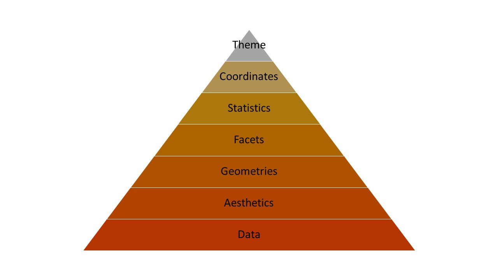
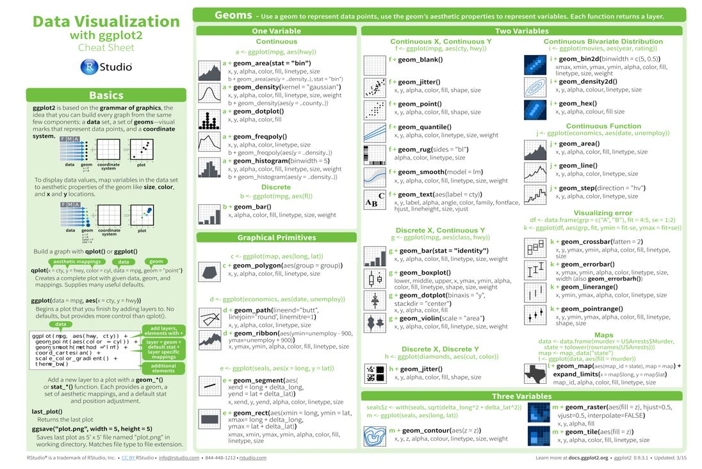
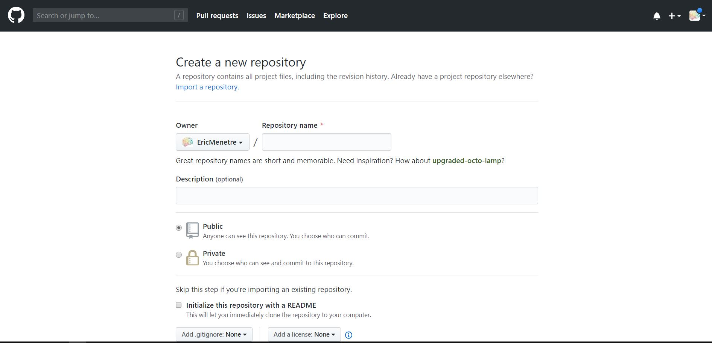
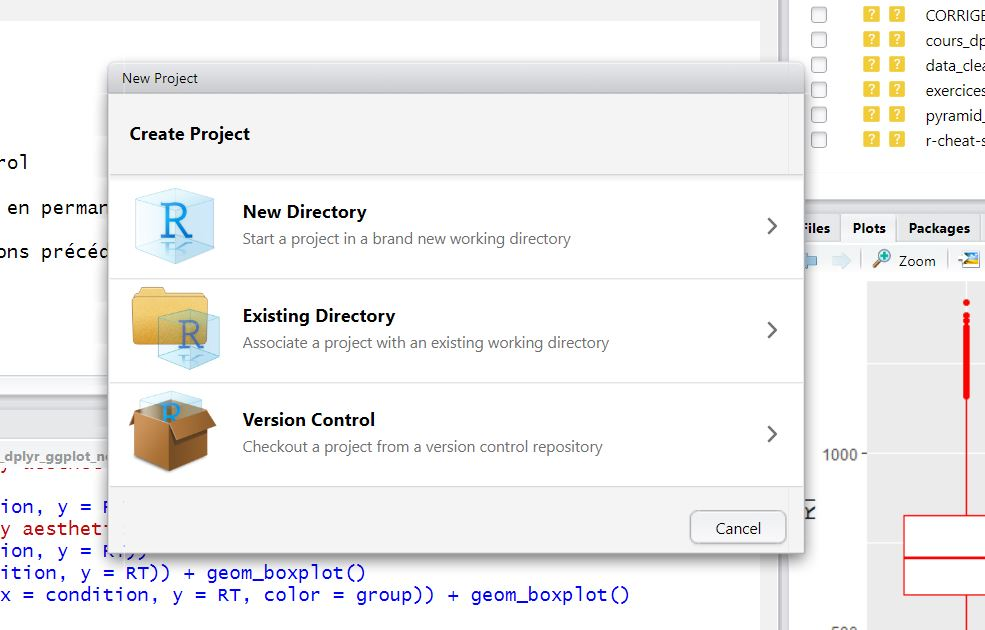
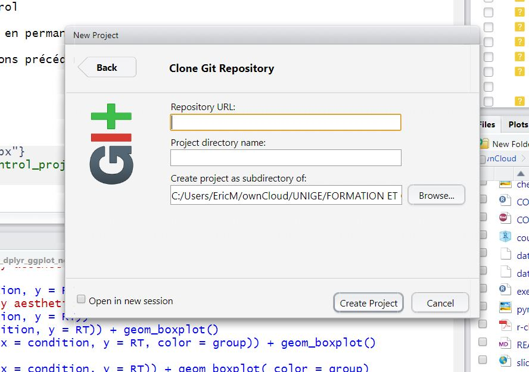
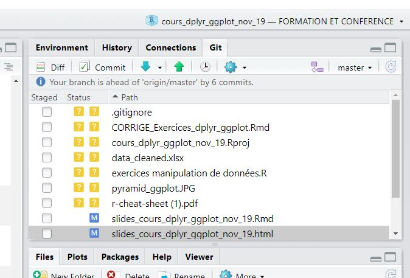
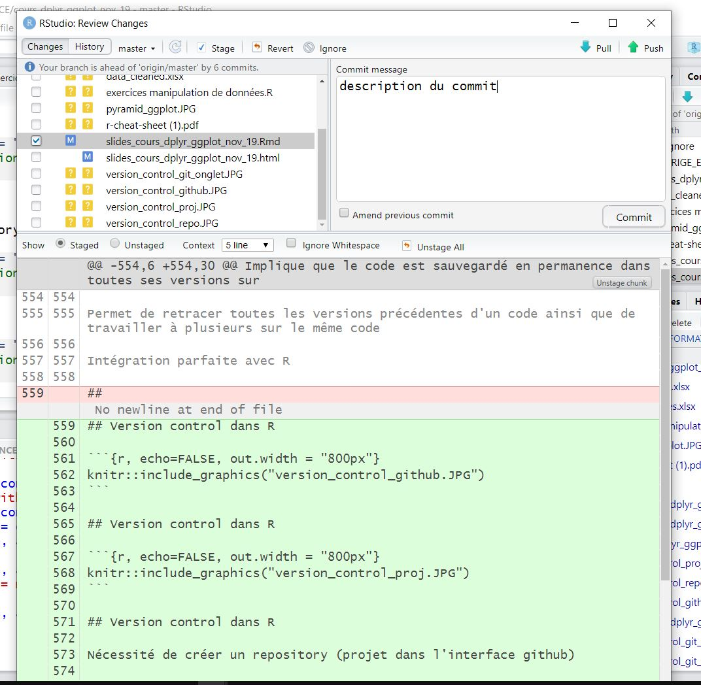

## Menu du jour

- Manipulation de données avec R
  - Intérêt du package dplyr comparé au package base
  - les 5 verbes de dplyr + opérateurs complémentaires
  - la combinaison des verbes par l'opérateur "pipe" %>%
  - survol de tidyr : spread et gather
- Visualisation de données avec ggplot2
  - Comment est structuré le code de ggplot
  - quelques exemples de plots possibles


# Manipulation de données avec R

## Intérêt du package dplyr

Pour la manipulation de données, le package base de R n'est pas optimal comparé à d'autres langage tels que SQL par exemple

```{r include=FALSE}
library(dplyr)
library(ggplot2)

```

```{r out.width = "300px", message=FALSE, warning=FALSE}

head(iris)


```

## Intérêt du package dplyr

Pour la manipulation de données, le package base de R n'est pas optimal comparé à d'autres langage tels que SQL par exemple

```{r}
str(iris)
```


## Intérêt du package dplyr

Pour la manipulation de données, le package base de R n'est pas optimal comparé à d'autres langage tels que SQL par exemple

```{r echo=TRUE}

data_temp <- iris[iris$Species == "setosa",]

str(data_temp)

```


## Intérêt du package dplyr

Pour la manipulation de données, le package base de R n'est pas optimal comparé à d'autres langage tels que SQL par exemple

Les arguments s'enchainent plus naturellement: data, colonne = "..."

```{r echo=TRUE}
library(dplyr)

data_temp <- filter(iris, Species == "setosa")

str(data_temp)

```


## Intérêt du package dplyr

Permet de combiner les verbes. Permet de combiner plusieurs opérations sans modifier le dataframe initial ni stocker les données dans une variable temporaire

```{r echo=TRUE, out.width = "300px"}
library(ggplot2)
iris%>%
  filter(Species == "setosa")%>%
  filter(Sepal.Length > 0.02)%>%
  select(Sepal.Length, Petal.Length)%>%
  ggplot(aes(x = Sepal.Length, y = Petal.Length))+
    geom_jitter()

```

## Les 5 verbes de dplyr + opérateurs complémentaires

dplyr compte 5 verbes/fonctions permettant d'effectuer presque toutes les opérations de manipulation de données. 


- filter() : permet de sélectionner seulement certaines lignes en fonction d'un ou plusieurs critères 

- select() : permet de sélectionner seulement certaines colonnes du data frame

- summarize(): permet de regroupper les données et de recalculer directement des moyennes, médiannes, compter...

- mutate() : permet de créer une nouvelle variable en fonction d'une autre ou modification d'une variable existante


## Les 5 verbes de dplyr + opérateurs complémentaires

- arrange() : permet de trier des données par ordre croissant/décroissant

En cas de doute voici une ressource utile:
https://teachingr.com/content/the-5-verbs-of-dplyr/the-5-verbs-of-dplyr-article.html#arrange

## Les 5 verbes de dplyr + "opérateurs complémentaires"

dplyr compte également des opérateurs complémentaires qui permettent de compléter les 5 verbes: 

- group_by : quand joint à summarize(), permet de regroupper les données en fonction d'une variable (cf. plus loin)

- rename : permet de renommer une variable 

- if_else : dans le verbe mutate, correspond au SI dans Excel

- ...

## filter()

filter permet de sélectionner des lignes dans un data frame en fonction d'un critère

Rappel: pour cumuler les filtres: & = ET ; | = OU. Dans filter, une virgule entre deux arguments correspond à ET. La commande produit un output mais *SANS* modifier le dataframe initial

```{r}
#filter(data, argument1 &| argument2 &| ... )

filter(iris, Species == "setosa" & Sepal.Length > 0.3)

```

## select()
Select permet d'isoler uniquement ceraines colonnes

```{r}
#select(data, colonne1, colonne2,...)

select(iris, Sepal.Width, Sepal.Length)

```

## summarize()
Summarise/summarize() permet de résumer les données à une valeur ou à un groupe de valeur en fonction des niveaux/facteurs d'une autre variables

```{r}
# ex. summarise(data, moyenne = mean(variable), mediane = median(variable)
#, N = n())

summarise(iris, 
          moyenne = mean(Sepal.Width), 
          mediane = median(Sepal.Width), 
          N = n())

```


## summarize() + group_by
Summarise/summarize() permet de résumer les données à une valeur ou à un groupe de valeur en fonction des niveaux/facteurs d'une autre variables

```{r}
data_temp <- group_by(iris, Species)
summarise(data_temp,
          moyenne = mean(Sepal.Width), 
          mediane = median(Sepal.Width), 
          N = n())

```

## mutate()

Mutate() permet de modifier une colonne ou de créer une colonne en fonction d'une autre colonne. Cette fonction simplifie l'utilisation des boucles for (cf. cours R précédent)

```{r}
data_temp <- select(iris, Sepal.Width)
# mutate(data, new_variable_name/variable_name = transformation)
mutate(data_temp, 
       Sepal.Width_2 = Sepal.Width + 3.14)

```

## mutate() + if_else

Imaginons que nous voulions ajouter 3.14 à chaque lignes appartenant à l'espèce setosa --> if_else()

```{r}
data_temp <- select(iris, Sepal.Width, Species)
# mutate(data, new_variable_name/variable_name = if_else(test, alors, sinon))
mutate(data_temp, 
       Sepal.Width_2 = if_else(Species == "setosa", 
                               Sepal.Width + 3.14, 
                               Sepal.Width))
```

## rename()

dplyr propose une solution relativement simple pour renommer des colonnes de dataframe

```{r}
data_temp <- select(iris, Sepal.Width, Species)
# mutate(data, nouveau_nom = ancien_nom)
rename(data_temp, Width = Sepal.Width)

```

## arrange ()

Comme avec Excel, il est possible de trier les données en fonction d'une ou plusieurs variables. 

```{r}
data_temp <- select(iris, Sepal.Width, Species)
# arrange(data, variable_to_order, desc(variable_to_order_in_desc._order))
arrange(data_temp, desc(Sepal.Width))

```

## L'argument pipe

De manière isolée, ces verbes sont plus simples que les fonctions de base mais pas vraiment plus efficaces --> possibilité d'utiliser l'argument pipe pour les combiner

l'argument pipe : %>% se place à la fin d'une commande et implique que le résultat servira d'input à la prochaine commande. Par exemple : 

```{r}
iris%>%
  filter(Species == "setosa")%>%
  select(Sepal.Length)%>%
  summarise(somme = sum(Sepal.Length))
```

## L'argument pipe

```{code}
iris%>%
  filter(Species == "setosa")%>%
  select(Sepal.Length)%>%
  summarise(somme = sum(Sepal.Length))
```

Ici, cela implique que partant des données (iris), cette base de données est filtrée de telle manière à ce que Species contienne uniquement Setosa comme valeur. De cette nouvelle base de données, seule la colonne Sepal.Length va être extraite, et finalement, sur cette colonne, la somme des valeurs va être calculée

## Exercices


## spread() et gather()

Spread() et gather() permettent de transposer certaines valeurs du data frame. 
Par exemple, dans le dataframe iris, chaque colonne contient des valeurs. Afin d'effectuer des statistiques sur ces données, il nous faudra une colonne regrouppant la taille (les valeurs, la VD), ainsi qu'une colonne contenant les labels de chaque condition. Afin de mettre les données en forme (tidy format), la fonction gather du package tidyr peut être utilisée 

```{r}
library(tidyr)

# gather(key = "nom_de_la_colonne_condition", 
#         value = "nom_de_la_colonne_valeur", 
#         -nom_des_colonnes_a_ignorer)

iris%>%
  gather(key = "part", value = "size", -Species)


```

## spread() et gather()


```{r}
iris%>%
  gather(key = "part", value = "size", -Species)
```

## spread() et gather()

Maintenant afin de rebalancer les données, il est possible d'utiliser la fonction spread()

```{r}
library(tibble) # nécessaire pour utiliser la fonction rowid_to_column()
temp <- iris%>%
  rowid_to_column(var = "ID")%>% # Il est nécessaire 
  #d'ajouter une colonne ID pour que spread()  puisse fonctionner
  gather(key = "part", value = "size", -Species, -ID)

temp%>%
  spread(part, size)
```

# Visualisation de données avec ggplot 2


## Structure 

Structure de la fonction ggplot:  


```{r, echo=FALSE, out.width = "800px"}

```


## ggplot: couche Data et Aesthetics

Les deux premières couches, data et aes sont la base de presques tous les plots ggplot

Pour utiliser ggplot, toujours commencer par appeler la fonction avec au moins les arguments data et aesthetics (aes)

```{code}
ggplot(data = iris, aes(...))

```


## ggplot: couche Data et Aesthetics

l'argument aes() permet de fournir des informations impactant toutes les couches suivantes. On peut y insérer les éléments suivants :

- x : colonne représentée sur l'axe x
- y : colonne représentée sur l'axe des y
- color : quand inséré dans aes(), permet de donner une couleur de contour à une condition
- fill : permet dépendamment de la géométrie, soit de séparer en condition (boxplots), soit de remplir d'une certaine couleur 
- size : permet d'associer une taille de point par exemple à une variable continue
- linetype : permet d'associer un type de ligne à une condition
- width : association épaisseur de ligne et condition


## ggplot: couche Data et Aesthetics

Exemples: 

```{r out.width = "500px"}
ggplot(iris, aes(x = Sepal.Length, y = Petal.Width, color = Species))
```

## ggplot: couche géométrie

Dans le graph précédent, rien est apparu, car nous n'avons pas spécifié à quoi devait ressembler le graph, quelle devait être sa géométrie. 

```{r out.width = "500px"}
ggplot(iris, aes(x = Sepal.Length, y = Petal.Width, color = Species)) + 
  geom_point()

```

## ggplot: couche géométrie

Attention, la géométrie dépend de la nature des variables, ggplot produira un output incohérent lorsque l'on souhaite insérer dans un boxplot une variable catégorielle.

```{r out.width = "500px"}
ggplot(iris, aes(x = Sepal.Length, y = Petal.Width, color = Species)) + 
  geom_boxplot()
```

## ggplot: couche géométrie

Attention, la géométrie dépend de la nature des variables, ggplot produira un output incohérent lorsque l'on souhaite insérer dans un boxplot deux variables continues.

```{r out.width = "500px"}
ggplot(iris, aes(x = Sepal.Length, y = Petal.Width, fill = Species)) + 
  geom_boxplot()
```

## ggplot: couche géométrie

Différentes géométries: 

```{r, echo=FALSE, out.width = "700px"}

```

## ggplot: couche géométrie

Quelques exemples: 
scatterplot

```{r out.width = "600px", message=FALSE, warning=FALSE}

ggplot(iris, aes(x = Petal.Width, y = Sepal.Width)) + geom_point()

```

## ggplot: couche géométrie

Quelques exemples: 
scatterplot (variante: peu adapté de mettre une couleur sur une variable continue)

```{r out.width = "600px", message=FALSE, warning=FALSE}

ggplot(iris, aes(x = Petal.Width, y = Sepal.Width, color = Petal.Length)) + 
  geom_point()

```

## ggplot: couche géométrie

Quelques exemples: 
Boxplot 
```{r out.width = "700px"}

ggplot(iris, aes(x = Species, y = Sepal.Width)) + geom_boxplot()

```

## ggplot: couche géométrie

Quelques exemples: 
histogrames (attention ne spécifier que x dans l'aes()!)

```{r out.width = "600px", message=FALSE, warning=FALSE}
ggplot(iris, aes(x = Sepal.Width)) + geom_histogram()

```

## ggplot: couche géométrie

Quelques exemples: 
plots de densité --> besoin de transformer les données en utilisant gather() ! Possibilité de combiner dplyr, tidyr et ggplot 

```{r out.width = "500px", message=FALSE, warning=FALSE}
iris%>%
  gather(key = "part", value = "size", -Species)%>%
ggplot(aes(x = size, fill = part)) + geom_density()

```

## ggplot: couche géométrie

Quelques exemples: 
barplot (en utilisant la même transformation que précédemment )

```{r out.width = "500px", message=FALSE, warning=FALSE}
iris%>%
  gather(key = "part", value = "size", -Species)%>%
  ggplot(aes(x = part, y = size)) + geom_bar(stat = "identity")
```

## ggplot: couche géométrie
Il est possible de combiner les géométries. Si ce que l'on souhaite est avoir un barplot avec les barres d'erreurs, il faut combiner dplyr et ggplot pour y arriver

```{r out.width = "300px", message=FALSE, warning=FALSE}
iris%>%
  group_by(Species)%>%
  summarise(moyenne.sepal.width = mean(Sepal.Width, na.rm = TRUE),
            sd.sepal.width = sd(Sepal.Width, na.rm = TRUE))
```

## ggplot: couche géométrie
Il est possible de combiner les géométries. Si ce que l'on souhaite est avoir un barplot avec les barres d'erreurs, il faut combiner dplyr et ggplot pour y arriver

```{r out.width = "250px", message=FALSE, warning=FALSE}
iris%>%
  group_by(Species)%>%
  summarise(moyenne.sepal.width = mean(Sepal.Width, na.rm = TRUE),
            sd.sepal.width = sd(Sepal.Width, na.rm = TRUE))%>%
  ggplot(aes(x = Species, y = moyenne.sepal.width)) + 
    geom_bar(stat = "identity")+
    geom_errorbar(aes(ymin = moyenne.sepal.width - sd.sepal.width, 
                      ymax = moyenne.sepal.width + sd.sepal.width))
```

## ggplot: couche facets 

Les facettes permettent d'ajouter une caractéristique mais sans quelle ne change en fonction d'une variable. Elles se spécifient dans la géométrie et vont concerner un attribut simple, comme la couleur par exemple 


```{r out.width = "450px", message=FALSE, warning=FALSE}
ggplot(iris, aes(x = Sepal.Width)) + 
  geom_histogram(color = "red")

```

## ggplot: couche facets 

Les facettes permettent d'ajouter une caractéristique mais sans quelle ne change en fonction d'une variable. Elles se spécifient dans la géométrie et vont concerner un attribut simple, comme la couleur par exemple 


```{r out.width = "450px", message=FALSE, warning=FALSE}
ggplot(iris, aes(x = Sepal.Width)) + 
  geom_histogram(color = "red", fill ="black")

```

## ggplot: couche facets 

Voici un autre exemple de facets en reprennant le graph de densité précédent

```{r out.width = "500px", message=FALSE, warning=FALSE}
iris%>%
  gather(key = "part", value = "size", -Species)%>%
ggplot(aes(x = size, fill = part)) + geom_density()

```

## ggplot: couche facets 

Voici un autre exemple de facets en reprennant le graph de densité précédent. Afin de voir toutes les distributions, il est nécessaire d'ajouter de la transparence aux distributions. Ceci se fait avec la facette alpha.

```{r out.width = "450px", message=FALSE, warning=FALSE}
iris%>%
  gather(key = "part", value = "size", -Species)%>%
ggplot(aes(x = size, fill = part)) + geom_density(alpha = 0.5)

```


## ggplot: couche theme

La couche thème permet de changer l'apparence du graph sans en changer le contenu. Il est possible de modifier le fond, le titre des axes, le titre du plot, et tous les autres éléments qui le composent.

Reprenons un plot : 

```{r out.width = "400px", message=FALSE, warning=FALSE}
ggplot(iris, aes(x = Species, y = Sepal.Width)) + geom_boxplot(width = 0.5)

```


## ggplot: couche theme

La couche thème permet de changer l'apparence du graph sans en changer le contenu. Il est possible de modifier le fond, le titre des axes, le titre du plot, et tous les autres éléments qui le composent.

Reprenons un plot : ajoutons un titre général aini que des titres d'axes

```{r out.width = "300px", message=FALSE, warning=FALSE}

ggplot(iris, aes(x = Species, y = Sepal.Width)) + geom_boxplot(width = 0.5)+
  labs(x = "Espèces", y = "largeur pétales", title = "Mon joli boxplot")

```

## ggplot: couche theme

La couche thème permet de changer l'apparence du graph sans en changer le contenu. Il est possible de modifier le fond, le titre des axes, le titre du plot, et tous les autres éléments qui le composent.

Reprenons un plot : maintenant changeaons le fond

```{r out.width = "300px", message=FALSE, warning=FALSE}

ggplot(iris, aes(x = Species, y = Sepal.Width)) + geom_boxplot(width = 0.5)+
  labs(x = "Espèces", y = "largeur pétales", title = "Mon joli boxplot")+
  theme_minimal()

```


# Introduction à Git 

## Introduction à Git

Git est un logiciel de version control

Implique que le code est sauvegardé en permanence dans toutes ses versions sur un server.

Permet de retracer toutes les versions précédentes d'un code ainsi que de travailler à plusieurs sur le même code

Intégration parfaite avec R

## Version control dans R

```{r, echo=FALSE, out.width = "800px"}

```

## Version control dans R

```{r, echo=FALSE, out.width = "800px"}

```

## Version control dans R

Nécessité de créer un repository (projet dans l'interface github)

```{r, echo=FALSE, out.width = "800px"}

```

## Version control dans R

```{r, echo=FALSE, out.width = "800px"}

```


## Version control dans R

```{r, echo=FALSE, out.width = "800px"}

```